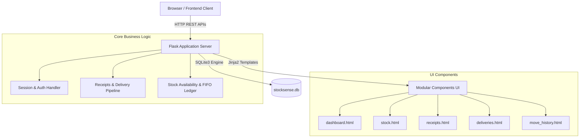

# StockSense — Modern Odoo Inventory Management System

> Built for the Odoo Hackathon: A full-stack, real-time Warehouse Management System (WMS) inspired by Odoo 17/18 inventory flows.

---

## 🌟 Key Features

1. **Dashboard & Real-time KPIs**
   - Live KPI cards for Receipts (To Receive, Late) and Deliveries (To Deliver, Waiting, Late).
   - Dynamic real-time statistics calculation based on operational status.

2. **Operations: Inward Receipts & Outward Deliveries**
   - **Receipts:** Dual List & Kanban views (`Draft` ➔ `Ready` ➔ `Done`). Automatic stock increment and Move History logging upon validation.
   - **Deliveries:** Real-time stock availability check. Automatic **Red-Line Alert** when items are out-of-stock; order held in `Waiting` state until stock arrives.
   - Printable delivery notes and receipt slips.

3. **Stock & Warehouse Management**
   - On-Hand vs. Free-To-Use inventory tracking.
   - Physical inventory adjustment and count reconciliation.
   - **Internal Transfers & Scrap:** Move inventory between racks (`WH/Stock1` ➔ `WH/Stock2`) or scrap damaged goods.

4. **Move History (Audit Trail Ledger)**
   - Color-coded ledger (`IN` in Green, `OUT` in Red, `INTERNAL` in Blue, `SCRAP` in Orange).
   - Filter by date range, operation type, search text, and instant CSV export.

---

## 🏗️ System Architecture



---

## 👥 Team & Work Distribution

| Member | Role | Key Contributions |
| :--- | :--- | :--- |
| **Anurag Kashyap** | Team Lead / Backend | Flask backend architecture, SQLite schema, Operations APIs, Auth & Session management, Component integration. |
| **Akash Sahani** | Frontend Developer | Stock tracking view, Inventory count adjustment, Internal Location Transfer & Scrap modal. |
| **Ankit Kumar** | Full-Stack Developer | Live Dashboard KPI metrics, Move History Ledger (Audit Trail), Kanban board views. |

---

## 🚀 Getting Started

### Prerequisites
- Python 3.8+
- Flask (`pip install flask`)

### Running Locally
```bash
# Clone the repository
git clone https://github.com/anuragkashyap5870/stock-sense.git
cd stock-sense

# Install Flask
pip install flask

# Run the development server
python app.py
```

Open your browser at **`http://127.0.0.1:5000`**

### Demo Credentials
- **Login ID:** `admin_odoo`
- **Password:** `Admin@123`
*(Or click "Sign Up" to create a new account)*
